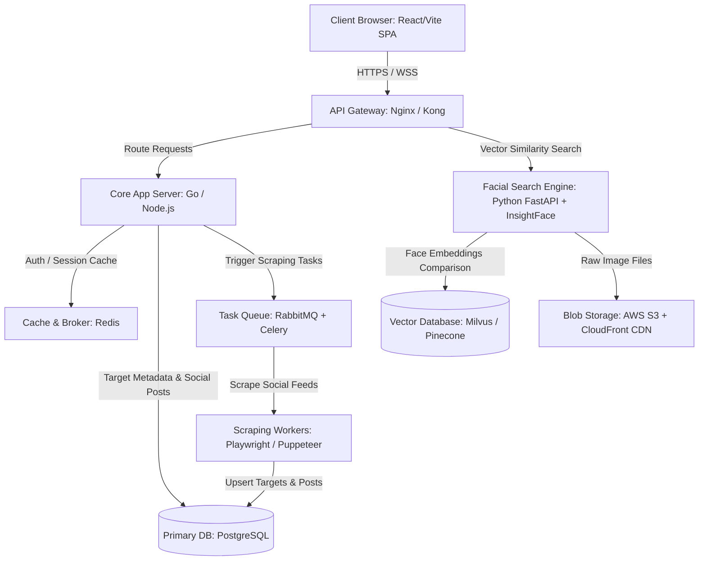

# SocialFinder OSINT - Startup MVP

**SocialFinder OSINT** is a high-fidelity, single-page web application (SPA) acting as a simulated Open Source Intelligence dashboard. It implements pixel-level client-side image similarity hashing (aHash), real-time biometric mesh rendering, dark-theme geospatial tracking, and simulated digital footprints.

---

## 🏗️ Production System Architecture (Scaling to Millions of Users)

For a production-ready cloud system, the application is structured with decoupled services, utilizing high-speed vector embeddings and query caches.



### Key Services
1. **Frontend**: Next.js / Vite SPA with Web Audio API for immersive digital sound synthesis.
2. **API Gateway / Load Balancer**: Nginx handles routing, SSL termination, and rate-limiting.
3. **Core App Server**: Go/Node backend managing business logic, target metadata, social posts, and authentication.
4. **Biometric Face Search Engine**: Python microservice generating 512-dimensional vector embeddings of faces (using InsightFace or FaceNet).
5. **Vector Database**: Pinecone or Milvus storing vector indices to execute sub-second similarity searches.
6. **Relational Database**: PostgreSQL storing user logins, target profiles, and social posts.
7. **Cache**: Redis storing target profile caches, API session states, and message brokers.
8. **Scraping Pipeline**: Distributed Puppeteer/Playwright workers executing background public feed scrapers via RabbitMQ.

---

## 🗄️ Database Schemas (PostgreSQL)

### 1. `users`
Tracks user login credentials and system roles.
- `id` (UUID, Primary Key)
- `email` (VARCHAR, Unique, Indexed)
- `password_hash` (VARCHAR, Argon2id hash)
- `role` (VARCHAR, Default: 'user')
- `created_at` (TIMESTAMP)

### 2. `targets`
Main catalog of tracked subjects.
- `id` (UUID, Primary Key)
- `user_id` (UUID, Foreign Key)
- `name` (VARCHAR)
- `bio` (TEXT)
- `image_url` (TEXT, AWS S3 URL)
- `image_hash` (VARCHAR, 64-bit Average Hash)
- `age` (INTEGER)
- `mood` (VARCHAR)
- `head_pose` (VARCHAR)
- `eye_dist` (VARCHAR)
- `created_at` (TIMESTAMP)

### 3. `locations`
Coordinates representing chronological tracking movement history.
- `id` (UUID, Primary Key)
- `target_id` (UUID, Foreign Key)
- `latitude` (DOUBLE PRECISION)
- `longitude` (DOUBLE PRECISION)
- `description` (VARCHAR)
- `timestamp` (TIMESTAMP)

### 4. `posts`
Simulated social media activity timeline.
- `id` (UUID, Primary Key)
- `target_id` (UUID, Foreign Key)
- `platform` (VARCHAR: 'twitter', 'instagram', or 'linkedin')
- `content` (TEXT)
- `timestamp` (TIMESTAMP)
- `likes` (INTEGER)
- `comments` (INTEGER)
- `location_id` (UUID, Foreign Key, Optional)

---

## 🔌 API Endpoints (Production Gateway)

- `POST /api/v1/auth/register` - Registers a new user.
- `POST /api/v1/auth/login` - Authenticates user and returns JWT.
- `POST /api/v1/search` - Searches database for face matching.
  - *Payload*: `multipart/form-data` containing image.
  - *Response*: Matched target metadata, similarity percentage, location tracks, and social feeds.
- `GET /api/v1/targets` - Lists all user targets.
- `POST /api/v1/targets` - Creates custom targets (image upload + bio info).
- `DELETE /api/v1/targets/{id}` - Deletes custom targets.

---

## 💻 Running the Local MVP SPA

Since the MVP executes all computations (biometrics mesh, average image hashing, geospatial drawing, and audio synthesis) entirely client-side, it is lightweight and has zero database dependencies.

### Option A: Using Python (Recommended)
Open a terminal in the project directory and execute:
```bash
python -m http.server 8000
```
Then visit: `http://localhost:8000`

### Option B: Using Node.js
Ensure you have Node.js installed, then run:
```bash
npx http-server -p 8000
```
Then visit: `http://localhost:8000`

---

## 🚀 Pushing the Project to Your GitHub

Since Git is not globally available on the environment path where this codebase was generated, you can push these files to your GitHub repository using your local development command line:

### 1. Initialize local Git repository
Open your command prompt or terminal inside this folder and run:
```bash
git init
```

### 2. Add files and make initial commit
```bash
git add .
git commit -m "feat: build SocialFinder OSINT facial tracking startup MVP"
```

### 3. Create a repository on GitHub
- Go to [GitHub](https://github.com) and log in.
- Click **New** to create a repository.
- Give it a name (e.g., `socialfinder-osint-mvp`) and leave it public or private.
- **Do not** initialize it with a README, `.gitignore`, or license (to avoid conflict).
- Click **Create repository**.

### 4. Link your remote repository and push
Copy the repository URL from GitHub and execute:
```bash
# Link the local repo to GitHub
git remote add origin https://github.com/YOUR_USERNAME/socialfinder-osint-mvp.git

# Set your branch name to main
git branch -M main

# Push the code
git push -u origin main
```
Your cyberpunk OSINT dashboard will now be live on your GitHub repository!
